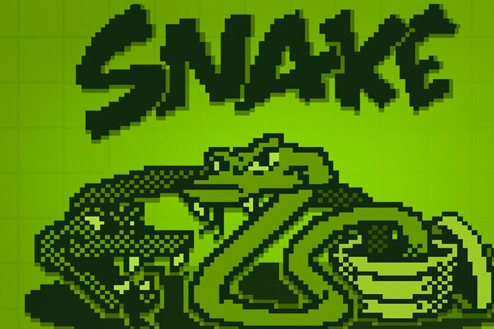

# Snake-Game

Este juego fue elaborado por:
+**Ernesto Misael Silva Muñoz 22310168**
+**Harold Galaviz Bañuelos 22310176**

## Snake
Este es una representacion del famoso juego Snake realizado en c++ utilizando como editor de codigo Visual estudio code y como compilador Msys2, tambien se utilizo la libreria externa SFML.

### Jugabilidad
Para jugar vas con seleccionar play y oprimir enter, el juego comenzara y tendras que ir comiendo las berenjenas para asi ir aumentando de tamaño

Los controles de la Serpiente son las flechitas y si llegas a colisionar con algun muro o tu propia cola perderas tu puntuacion

La puntuacion aparecera del lado superior izquierdo y por cada berenjena se sumara un punto.

## Como ejecutar
Para ejecutar el juego basta con escrbir dentro de la terminal de VScode:

>make run

## Programas necesarios

### Visual estudio code
Descargar e instalar vscode en el soguiente enlace [Vscode.](https://code.visualstudio.com/)

### MSYS2 (Window)
Instalar Msys2 usando el siguiente enlace [MSYS2(Windows)](https://github.com/msys2/msys2-installer/releases/download/2023-05-26/msys2-x86_64-20230526.exe)

No modificar ninguna opcion al momento de instalacion o podrian variar las configuraciones.

Una vez instalado es necesario agregar los siguientes directorios al path de windows y reiniciar.

> C:\msys64\mingw64\bin

> C:\msys64\usr\bin

### Github Desktop
Puedes utilizar Github Desktop para clonar el repositorio o bien descargarlo desde el navegador[GithubDesktop](https://desktop.github.com/)

## Librerias Utilizadas (Msys2)

Ejecutar los siguientes comandos en la terminal de Msys2 para instalar las dependencias necesarias.

### Devtools
Compiladores y herramientas necesarias para el desarrollo.

https://code.visualstudio.com/docs/cpp/config-mingw
> pacman -S --needed base-devel mingw-w64-x86_64-toolchain

### SFML
https://packages.msys2.org/package/mingw-w64-x86_64-sfml
> pacman -S mingw-w64-x86_64-sfml